---
title: Previous Symposium
...

Here you can find the schedule and pictures from the first symposium.
Email us if you have some you would like to include here next year!

<iframe src="/files/2016/pamphlet.pdf"
        style="border: none; height: 90vh;"
        width="750px">
  Your browser does not support viewing this PDF, but you can still download it:
  <a href="/files/2016/pamphlet.pdf">Download PDF</a>
</iframe>

<!-- TODO auto-insert with Hakyll? -->

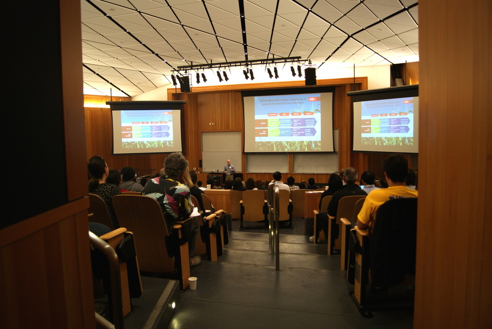

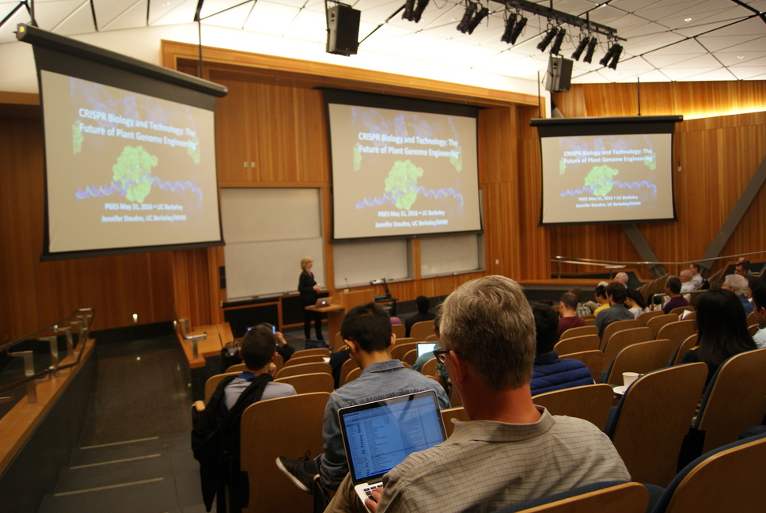

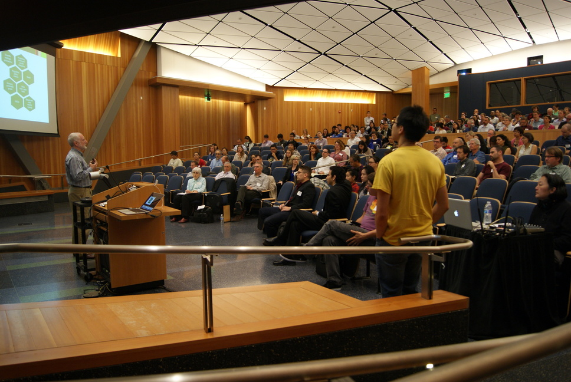

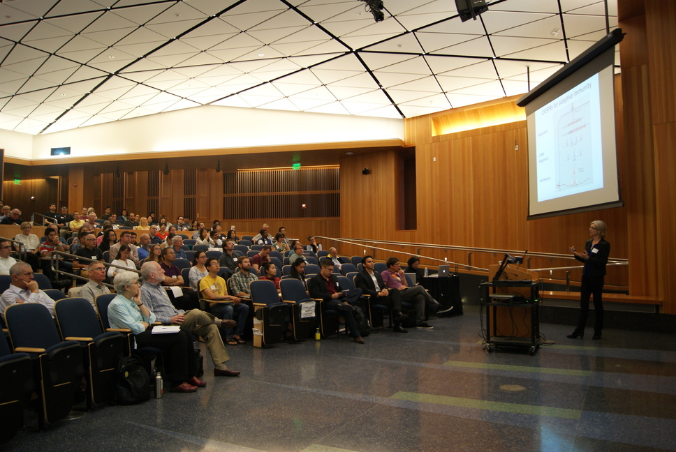

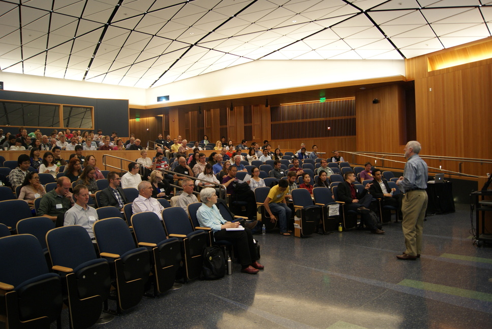

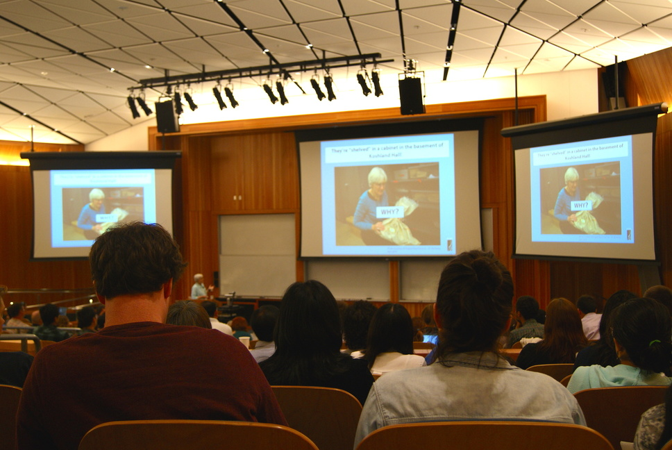

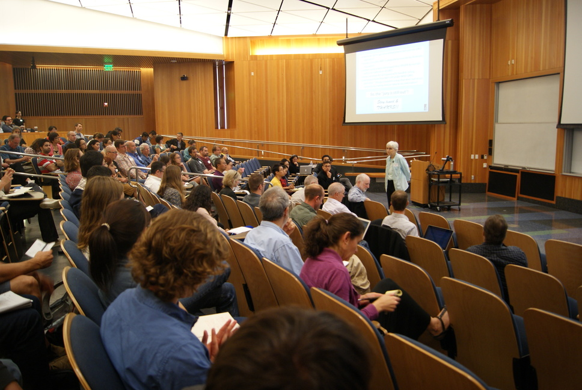

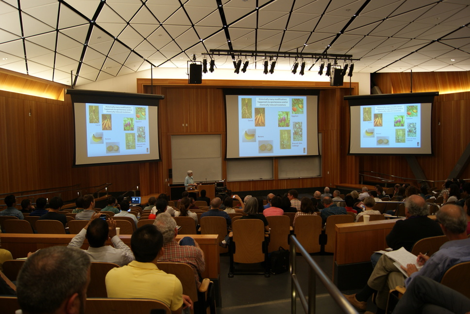

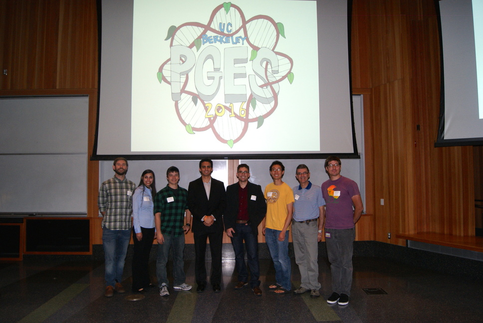

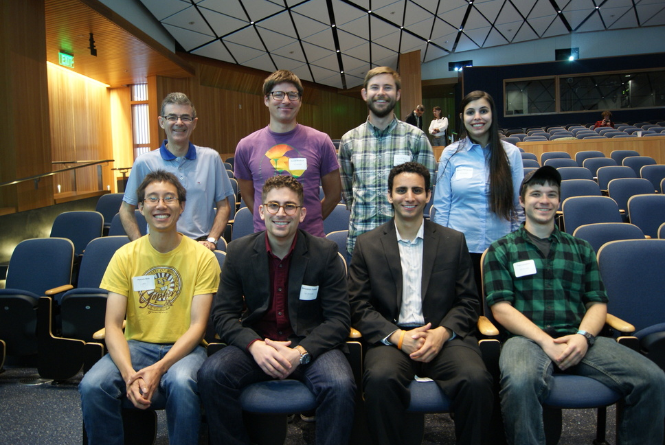

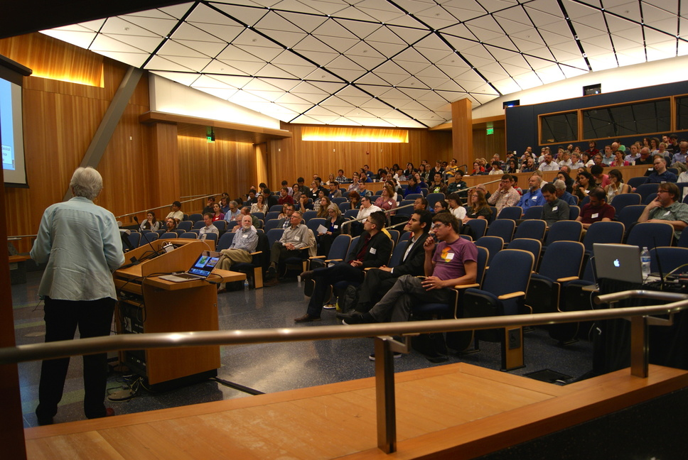

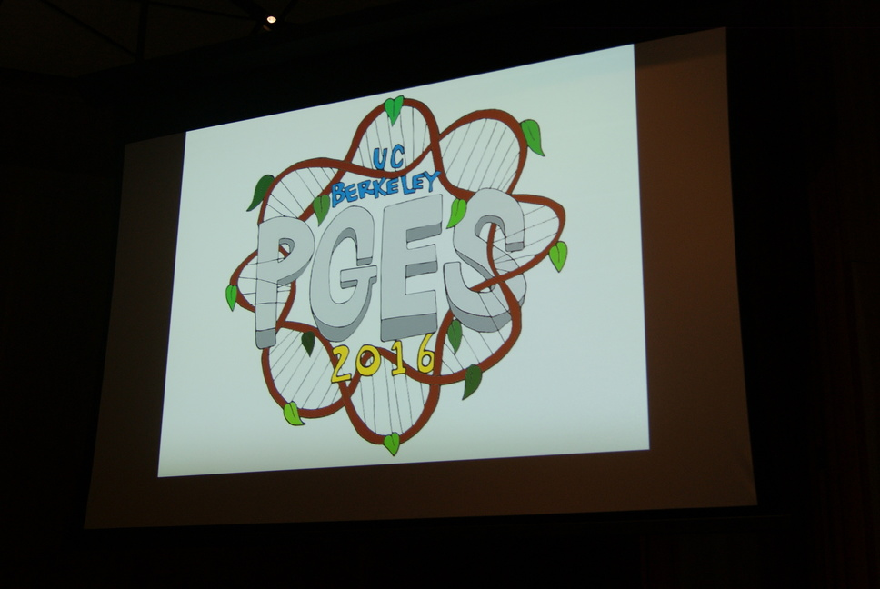

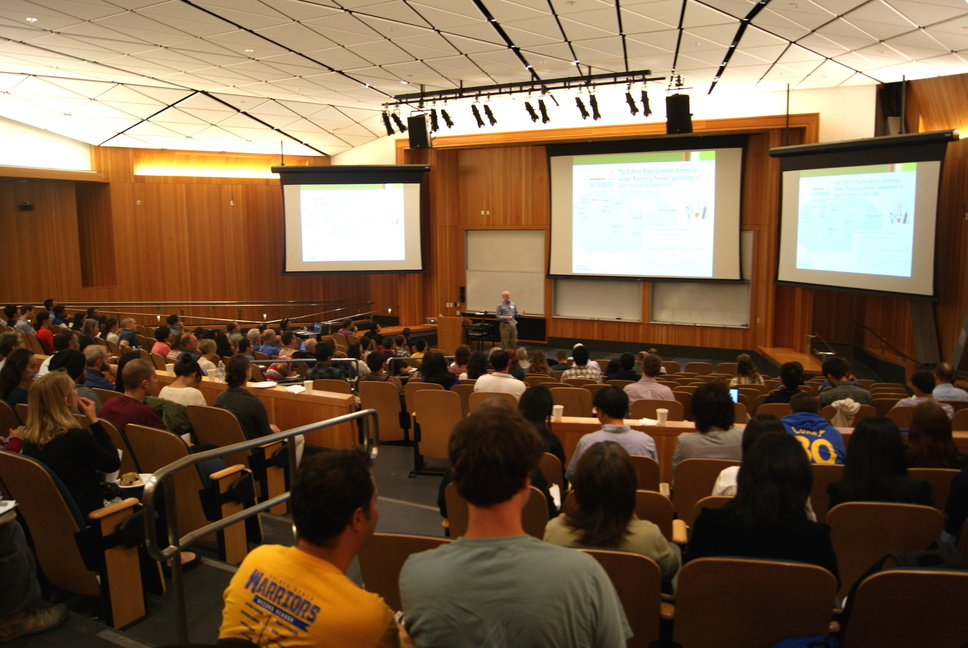

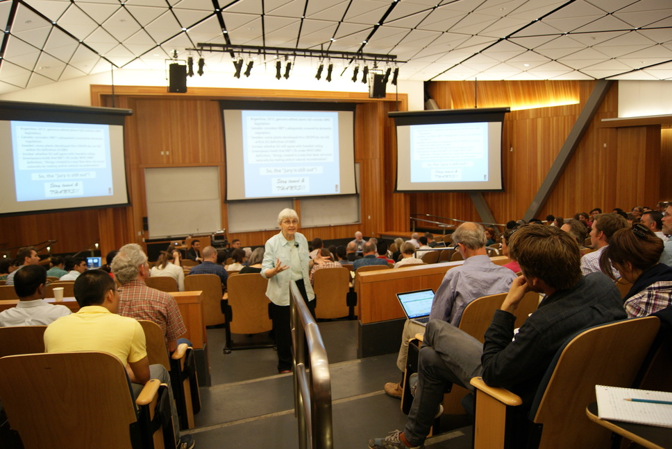

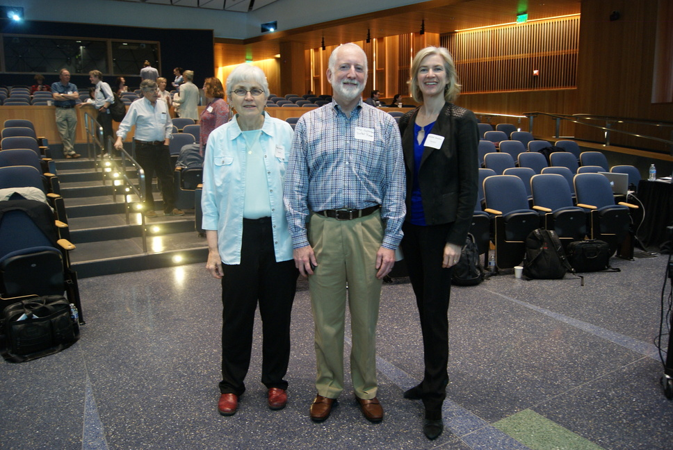
